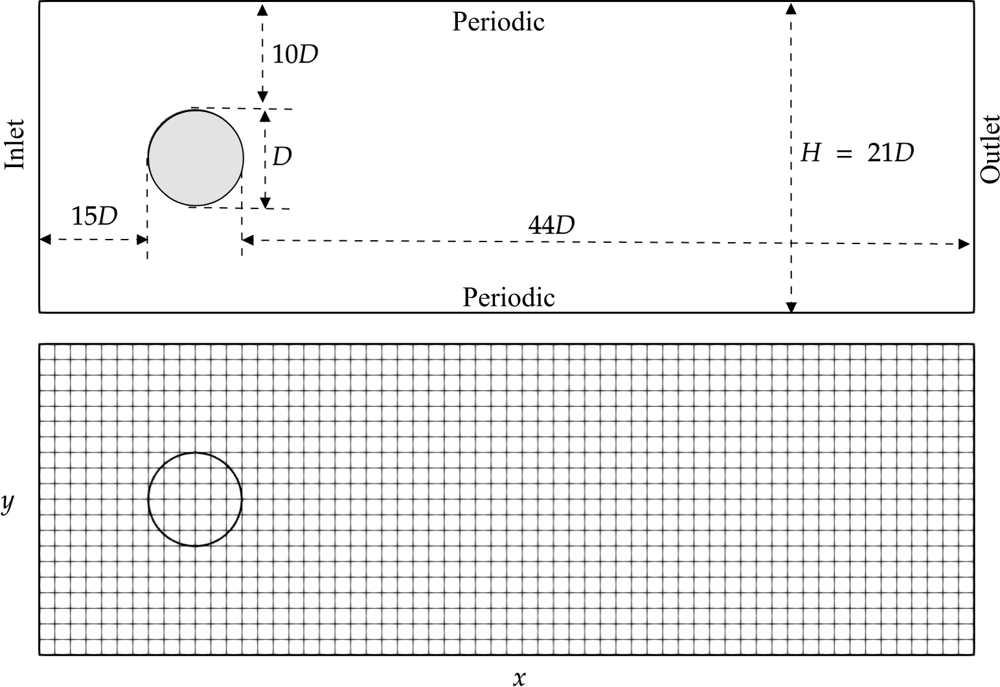

# 🩸 Moment-Based Regularized Lattice Boltzmann Solver (MRLBM)

## Overview
This repository contains a high-performance implementation of the **Moment-Based Regularized Lattice Boltzmann Method (MRLBM)** for simulating **2D incompressible flow past a circular cylinder**.  
The solver is developed to demonstrate the advantages of the MRLBM framework—namely **improved numerical stability**, **reduced memory usage**, and **efficient handling of curved geometries**.

The code serves as a baseline for extending MRLBM to complex and three-dimensional geometries.

---

## ✳️ Key Features
- **Moment-Based Formulation:** Stores and evolves only macroscopic moments instead of full distribution functions.  
- **Regularized Collision Operator:** Enhances stability by filtering out non-hydrodynamic moments.  
- **Curved Boundary Conditions:** Implements second-order accurate curved boundary treatment for the cylinder surface.  
- **Parallel-Ready:** Structured to support future GPU or MPI parallelization.  
- **Validation:** Verified against benchmark results for flow past a cylinder across a range of Reynolds numbers.

---

## 🧩 Governing Model
- **Lattice:** D2Q9 model  
- **Collision Operator:** Regularized single-relaxation-time (BGK-type) in moment space  
- **Boundary Conditions:**  
  - Inlet: Constant velocity  
  - Outlet: Neumann (zero-gradient) condition  
  - Cylinder: No-slip curved boundary condition  
  - Walls: Bounce-back or symmetry  

---

## 🧱 Code Structure
MRLBM-Cylinder/
├── src/
│   ├── mrlbm_module.f90          # Core MRLBM routines (moments, collision, streaming)
│   ├── boundary_conditions.f90   # Curved and standard boundary implementations
│   ├── initialize.f90            # Grid and field initialization
│   ├── postprocessing.f90        # Drag, lift, and Strouhal number calculation
│   └── main.f90                  # Main driver
│
├── input/
│   └── parameters.dat            # Simulation parameters (Re, Nx, Ny, etc.)
│
├── output/
│   ├── grid.vti                  # Geometry file for ParaView
│   ├── data_000.vti              # Time-dependent flow field
│   └── results/                  # Time-averaged quantities
│
├── build/                        # Compiled objects and executable
└── README.md                     # Project documentation


# Moments-Based Regularized LBM with Curved Boundary Conditions

This repository contains the implementation for a **Moments-Based Regularized Lattice Boltzmann Method (MRLBM)** featuring a novel **curved boundary treatment** for accurate and efficient simulation of flows past complex geometries on Cartesian grids.

## 🧩 Project Overview

We develop a robust curved boundary condition for the 2D MRLBM, combining the computational efficiency of uniform Cartesian grids with accurate curved-boundary representation through **moment regularization** and **extrapolation**.

### Key Features:
- **Memory-Efficient MRLBM**: Stores macroscopic moments instead of full distribution functions, reducing memory usage by **33% (2D)** compared to conventional LBM.
- **Novel Curved Boundary Treatment**: Implements two methods:
  - **Method A**: Cartesian coordinate approach.
  - **Method B (Recommended)**: Rotated coordinate system aligned with boundary normals for enhanced stability.
- **Extrapolation-Based Technique**: Uses quadratic extrapolation to impose wall conditions accurately on stair-case approximated surfaces.
- **GPU-Accelerated**: Highly parallelizable implementation demonstrating significant speedup.

## 📋 Methodology Summary

### Governing Equations
The core evolution of the particle distribution function is split into:
1.  **Collision**: Performed in moments space using a BGK operator.
    ```math
    \rho^* m^{*(2)}_{\alpha\beta} = (1-\omega \Delta t) \rho m^{(2)}_{\alpha\beta} + \omega \Delta t \rho u_\alpha u_\beta
    ```
2.  **Regularization**: Filters non-hydrodynamic modes from the distribution function.
    ```math
    f^*_i = \rho w_i \left( 1+  a_s^2 u_\alpha c_{i\alpha} + \frac{1}{2} a_s^{4} m^{*(2)}_{\alpha\beta} H^{(2)}_{\alpha\beta,i} \right)
    ```
3.  **Streaming**: Propagates regularized distributions to neighboring nodes.
    ```math
    f_i(\mathbf{x}+\mathbf{c}_i \Delta t, t+\Delta t) = f^{*}_i(\mathbf{x}, t)
    ```

### Curved Boundary Treatment (Method B)
For curved boundaries, the algorithm:
1.  Classifies nodes into **Fluid**, **Boundary**, and **Solid**.
2.  At boundary nodes, macroscopic variables are determined via **quadratic extrapolation** along the wall-normal direction.
3.  Uses a **local rotated coordinate system** `(x', y')` aligned with the boundary normal/tangential directions.
4.  Enforces boundary conditions by solving a system formed by the strong form of mass conservation and second-order moment constraints in this local frame.

<!-- GEOMETRY FIGURE WILL BE PLACED HERE -->
<p align="center">
  
  <br>
  <em>Geometry configuration for flow past a cylinder.</em>
</p>

## 🚀 Installation & Compilation

### Prerequisites
- A C++ compiler supporting C++17 (e.g., `g++`, `clang++`)
- NVIDIA CUDA Toolkit (for GPU acceleration)

### Build Instructions
```bash
# Clone the repository
git clone https://github.com/your_username/your_repo_name.git
cd your_repo_name

# compile and run
cd MR_LBM/src
bash compile.sh "sim ID"

